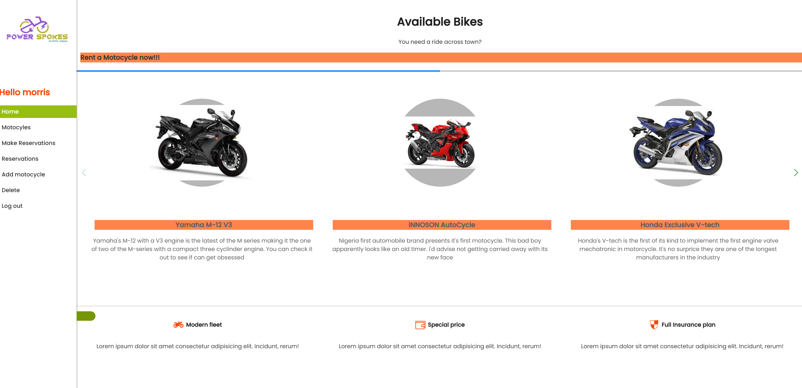
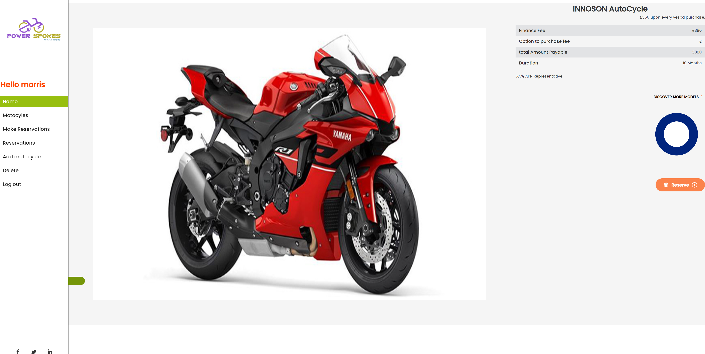

# Final-capstone-project

# Power Spokes

Power-Spokes is a booking app for motorcycles where users get to book a reservation for a motorcycles

You can see the backend for this project(https://github.com/Addisu87/capstone-appointment-back-end).

## Kanban Board

[Kanban Board Link](https://user-images.githubusercontent.com/97867917/196933806-cabeff2f-a288-4d0b-8a52-9e8b883d741c.PNG)

- We are four (3) in this team.

  - @Emmykage
  - @Isaacpitwa
  - @Addisu87

### Our Kanban board

<table>
<tr>
<td></td>
<td></td>

</tr>
</table>

## Built With

- React
- Redux
- Deployed with Netlify

## Live Demo & Screenshots

> [POWER-STROKE](https://final-capstone-project-udqc.vercel.app/)

<table>
<tr>
<td></td>
<td></td>
<td></td>
</tr>
</table>


## Getting Started

To get a local copy up and running follow these simple example steps.

### Prerequisites

- Any web browser (e.g. Google Chrome)
- Any Code Editor (e.g. Vscode)
- NodeJS

### Setup

- Create a new folder.

```bash
mkdir folder
```

- Move to the folder:

```bash
cd folder
```

- Clone the repo:

```bash
git clone https://github.com/Emmykage/Final-capstone-project.git
```

### Install

- Install the dependencies:

```
npm install
```

### Usage

- Start a live development server:

```
npm start
```

### Run tests

- Run tests:

```
npm test
```

## Authors

## 👤 Menanya Morris

- GitHub: [@emmykage](https://github.com/emmykage)
- Twitter: [@emmykage](https://twitter.com/emmykage)
- LinkedIn: [Menanya Morris](https://www.linkedin.com/in/morris-menanya-a51985104/)

## 👤 Isaac Pitwa

- GitHub: [@isaacpitwa](https://github.com/isaacpitwa)
- Twitter: [@isaacpitwa](https://twitter.com/isaacpitwa)
- LinkedIn: [LinkedIn](https://linkedin.com/in/isaac-pitwa)

👤 Addisu Haile

- GitHub: [@Addisu87](https://img.shields.io/badge/-Addisu87-white?logo=GitHub&logoColor=181717&style=plastic)
- Twitter: [@AddisuTedla](https://img.shields.io/badge/-AddisuTedla-white?logo=Twitter&logoColor=1DA1F2&style=plastic)
- LinkedIn: [addisu-tedla](https://img.shields.io/badge/-addisu_tedla-white?logo=LinkedIn&logoColor=1DA1F2&style=plastic)


## 🤝 Contributing

Contributions, issues, and feature requests are welcome!

Feel free to check the [issues page](https://github.com/Emmykage/Final-capstone-project/issues).

## Show your support

Give a ⭐️ if you like this project!

## Acknowledgments

- Original design idea by: [Murat Korkmaz](https://www.behance.net/muratk)

## 📝 License

This project is [MIT](./MIT.md) licensed.
